# Amazing Spaces

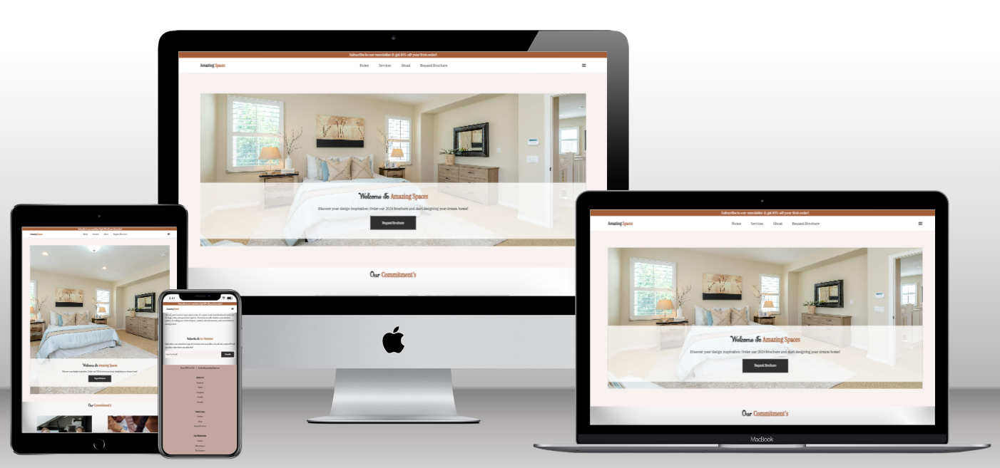

Amazing Spaces is a fictional interior design company with showrooms situated throught the uk.
They offer a wide variety of interior design services ranging from kitchen's to living spaces.

The purpose of this website is to provide information on the services they provide, and it's contact options.
The website targets an audience of new customers looking to design and renovate there homes.

## Table of Contents

1. [User Experience (UX)](#user-experience-ux)
    1. [Project Goals](#project-goals)
    2. [User Stories](#user-stories)
    3. [Color Scheme](#color-scheme)
    4. [Typography](#typography)
    5. [Wireframes](#wireframes)
2. [Features](#features)
    1. [General](#general)
    2. [Landing Page](#landing-page)
    3. [Treatments Page](#services-page)
    4. [Book Now Page](#about-page)
    5. [404 Error Page](#request-brochure-page)
 3. [Technologies Used](#technologies-used)
    1. [Languages Used](#languages-used)
    2. [Frameworks, Libraries and Programs Used](#frameworks-libraries-and-programs-used)
4. [Testing](#testing)
    1. [Testing User Stories](#testing-user-stories)
    2. [Code Validation](#code-validation)
    3. [Accessibility](#accessibility)
    4. [Tools Testing](#tools-testing)
    5. [Manual Testing](#manual-testing)
5. [Finished Product](#finished-product)
6. [Deployment](#deployment)
    1. [GitHub Pages](#github-pages)
7. [Credits](#credits)
    1. [Content](#content)
    2. [Media](#media)
    3. [Code](#code)
8. [Acknowledgements](#acknowledgements)

***

## User Experience (UX)

### Project Goals

* The website should have a calming and modern design, appealing to the customers.

* Present information on the website that details and sells the services they provide.

* Provide the customer with useful information that can facilitate future interaction with the business.

* Offer the customers the opportunity to book a consultation with a designer.

* Offer the customers the opportunity to request the latest design's brochure.

### User Stories

* As a customer, I want to be able to navigate the website intuitively and learn more about the business and services being offered.

* As a customer, I want to be able to read more about the services available.

* As a customer, I want to easily find the contact information for the business.

* As a customer, I want to find social media links to the business.

* As a customer, I want to be able to book a consultation directly from the website.

* As a customer, I want to easily find the business' location.

### Color Scheme
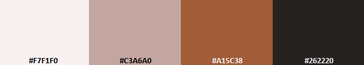

The colors used in the site are three different tones of brown (#F7F1F0 and #C3A6A0 and #A15C38), a brown color (#784834) and a dark grey color (#262220) for the main text. These colors are chosen to represent a clean and modern look.

### Typography

The main font used in the site is Instrument, with Sans Serif as the fallback font in case Instrument is not being imported correctly. Sevillana is used for the headings, with cursive as fallback. 

### Wireframes

[Figma](https://figma.com/) has been used to showcase the appearance of the site and display the placement of the different elements whitin the pages.

Page | Desktop Version | Mobile Version
--- | --- | ---
Index | 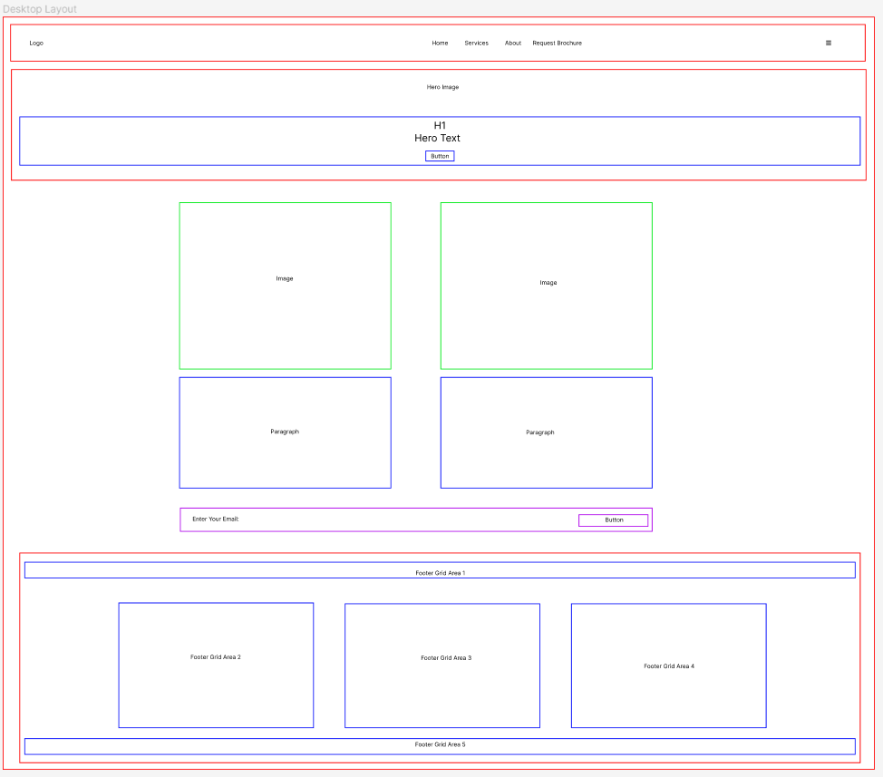 | 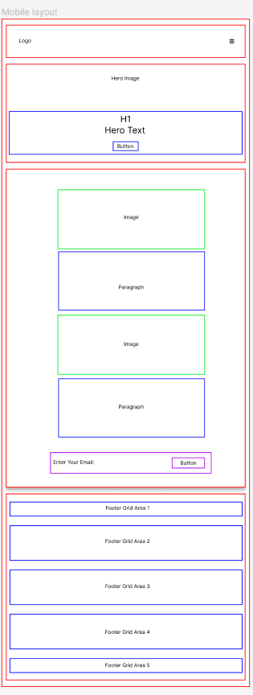
Services | 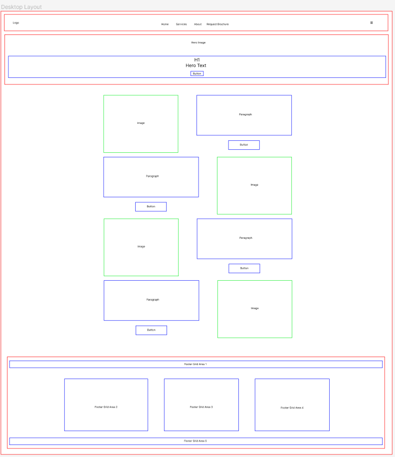 | 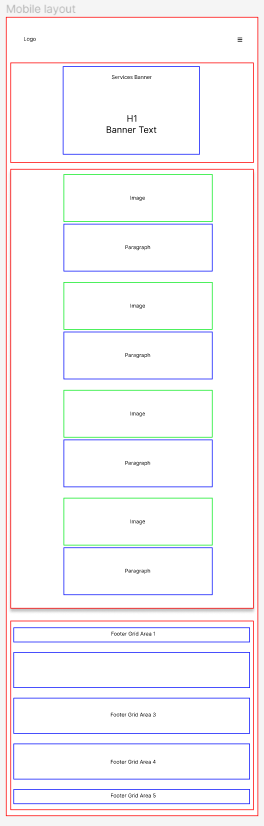
About |  | 
Request Brochure |  | 

[Back to top ⇧](#Amazing_Spaces)

## Features

### General

* Responsive design across all device sizes.

* Similar color scheme and design throughout all pages to effectively structure, categorise and present the information to the customers.

* **Header**
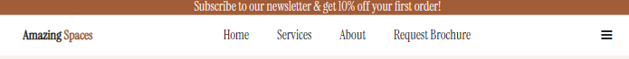
    
    - The header contains the business logo and fully responsive navigation bar positioned across the top of the screen. There is also a menu icon to open the side navigation bar.

    - The business logo functions as a link to the landing page.

    - The navigation bar is identical in all pages and contains links to all pages to facilitate navigation across the site. It also has a hover effect that changes color to provide feedback to the customer for a better user experience.

* **Footer**
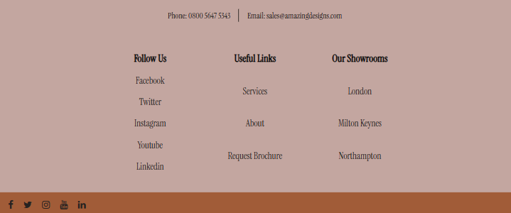

    - The footer includes contact information aswell as useful links to social media sites and access to other pages on the website.

### Landing Page

* **Main Image**
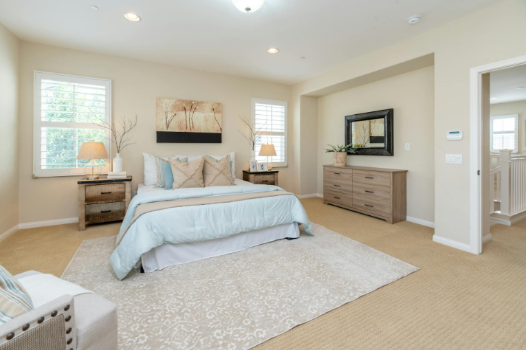

    - The main image is designed to attract the customer's attention and represents a modern sylish room. It is one of 3 main images that change when on the landing page.

### Services Page

* **Banner Section**
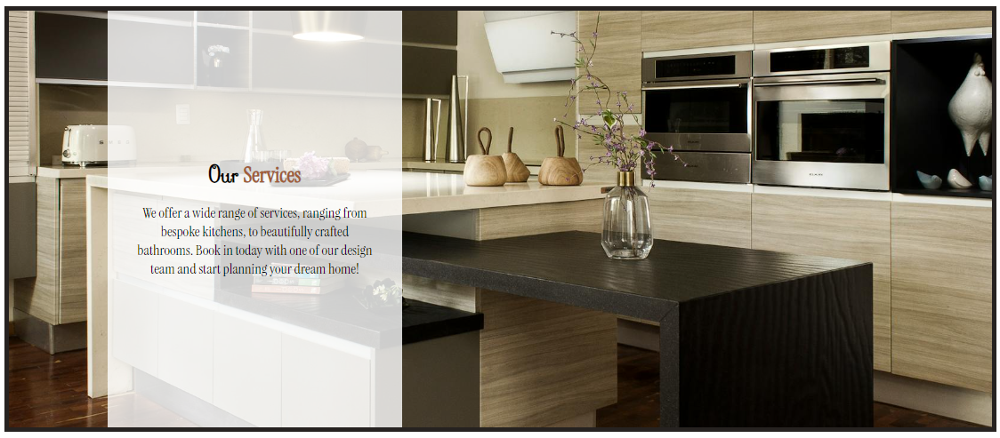

    - The banner contains an image of a bespoke kitchen as well as a small paragraph detailing the services offered.

* **Our Services Section**
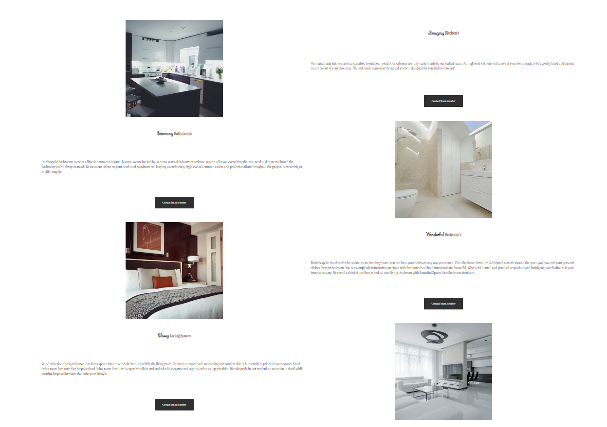

    - Contains eye catching images and information on the services available aswell as a contact button for each service that directs you to the contact us form.

### About Page

* **About Banner**
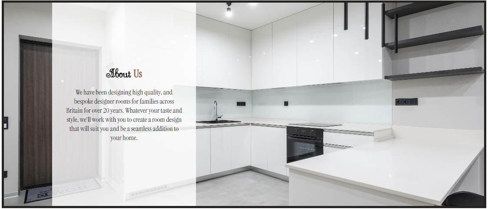

    - The banner section contains an image of a modern kitchen and a small paragragh 
    about the company.

* **Why Us Section**
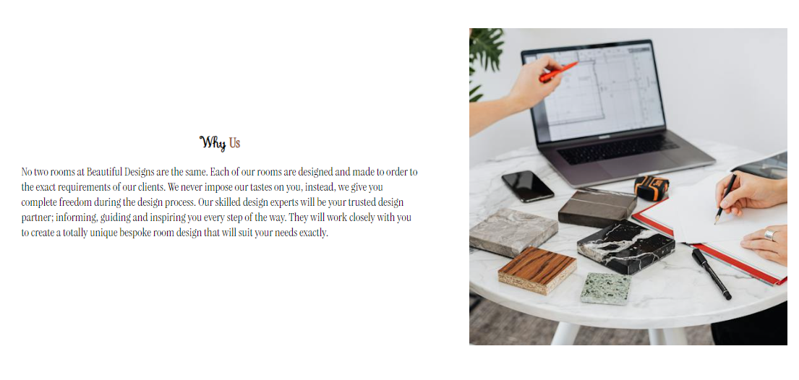

    - This section gives the site a chance to sell why new customers should choose the
    company to help design there dream home.

* **Contact Us Section**
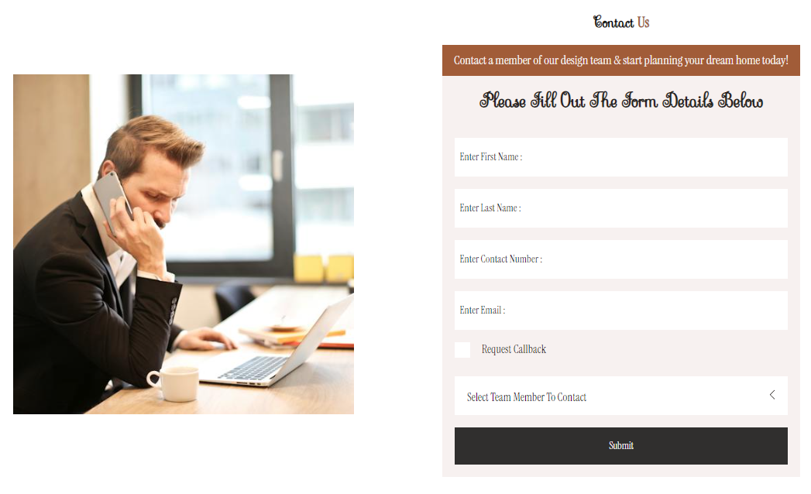

    - This section contains an image of a man being contacted and the contact us form itself.
    

### Request Brochure Page
 
* **Request Brochure Banner**

    - The form allows the customer to book the desired treatment on a specific date directly from the business' website.

* **Find Us Section**

    - This section displays a Google map of the business' geographical location. This allows the customers to easily find the location from their devices.

[Back to top ⇧](#Amazing_Spaces)

## Technologies Used

### Languages Used
* [HTML5](https://en.wikipedia.org/wiki/HTML5)
* [CSS3](https://en.wikipedia.org/wiki/CSS)

### Frameworks, Libraries and Programs Used

* [Google Fonts](https://fonts.google.com/)
    - Google Fonts was used to import the fonts Instrument and Sevillana into the style.css file. These fonts were used throughout the site.

* [Font Awesome](https://fontawesome.com/)
     - Font Awesome was used throughout all pages to add icons in order to create a better visual experience for UX purposes.

* [VSCode](https://code.visualstudio.com/)
     - VSCode was used for writing code, committing, and then pushing to GitHub.

* [GitHub](https://github.com/)
     - GitHub was used to store the project after pushing.

* [Figma](https://figma.com/)
     - Figma was used to create the wireframes during the design phase of the project.

* [Am I Responsive?](http://ami.responsivedesign.is/#)
    - Am I Responsive was used in order to see responsive design throughout the process and to generate mockup imagery to be used.

* [Responsive Design Checker](https://www.responsivedesignchecker.com/)
    - Responsive Design Checker was used in the testing process to check responsiveness on various devices.

* [Chrome DevTools](https://developer.chrome.com/docs/devtools/)
    - Chrome DevTools was used during development process for code review and to test responsiveness.

* [W3C Markup Validator](https://validator.w3.org/)
    - W3C Markup Validator was used to validate the HTML code.

* [W3C CSS Validator](https://jigsaw.w3.org/css-validator/)
    - W3C CSS Validator was used to validate the CSS code.

[Back to top ⇧](#pura-vida-spa)

## Testing

### Testing User Stories

* As a customer, I want to be able to navigate the website intuitively and learn more about the business and services being offered.

     - The website offers a intuitive structure for the customers to navigate and find the information they are looking for.

    - The navigation bar is clearly presented in all pages for the customers to find with ease and it is easily navigable.

* As a customer, I want to be able to read more about the services available.

    - The services page presents all services available, each on their own section.

    - Each service section contains useful information about the respective treatment.

* As a customer, I want to easily find the contact information for the business.

    - The landing page contains a clear contact section with all necessary business' contacts

* As a customer, I want to find social media links to the business.

    - The footer provides link to the business' social media channels.

* As a customer, I want to be able to contact a design specialist from the website.

    - The book now page provides a book now form for the customer to book and schedule their next treatment.

* As a customer, I want to easily find the business' location.

    - The book now page contains a find us section with a Google map of the business' geographical location.

### Code Validation

* The [W3C Markup Validator](https://validator.w3.org/) and [W3C CSS Validator](https://jigsaw.w3.org/css-validator/) services were used to validate all pages of the project in order to ensure there were no syntax errors.

    - W3C Markup Validator found an error concerning headings not being included on the main and book now images. The section tag was replaced for a div tag to correct this. 
    
    - Another error found by W3C Markup Validator was concerning a percentage value used inside the iframe tag to declare the width property on the Book Now page. The width and height properties for the iframe were declared inside the CSS file instead.

    -  W3C CSS Validator found no errors or warnings on my CSS.

### Accessibility

* Used Lighthouse in Chrome DevTools to confirm that the colors and fonts being used in throughout the website are easy to read and accessible.

* Lighthouse reports

    - **Landing Page**

    

    - **Services Page**

    

    - **About Page**

    

    - **Request Brochure Page**

    

### Tools Testing

* [Chrome DevTools](https://developer.chrome.com/docs/devtools/)

    - Chrome DevTools was used during the development process to test, explore and modify HTML elements and CSS styles used in the project.

* Responsiveness
    
    - [Am I Responsive?](http://ami.responsivedesign.is/#) was used to check responsiveness of the site pages across different devices.

    - [Responsive Design Checker](https://www.responsivedesignchecker.com/) was used to check responsiveness of the site pages on different screen sizes.
    
    - Chrome DevTools was used to test responsiveness in different screen sizes during the development process.

### Manual Testing

* Browser Compatibility

    - The website has been tested on the following browsers:

        - **Google Chrome**
        
        No appearance, responsiveness nor functionality issues.

        - **Safari**
        
        No appearance, responsiveness nor functionality issues.

        - **Mozilla Firefox**
        
        There was and issue with the appearance of the book buttons on the treatments page expanding all the width. This issue was corrected by changing the width property value from "fit-content" to "max-content".
        
        No responsiveness nor functionality issues.

        - **Microsoft Edge**
        
        No appearance, responsiveness nor functionality issues.

* Device compatibility

    - The website has been tested on multiple devices, including:

        - **MacBook Pro 15"**

        No appearance, responsiveness nor functionality issues.

        - **Dell Latitude 5300**

        No appearance, responsiveness nor functionality issues.

        - **iPad Pro 12.9"**

        No appearance, responsiveness nor functionality issues.

        - **iPad Pro 10.5"**

        No appearance, responsiveness nor functionality issues.

        - **iPhone XR**
        
        No appearance, responsiveness nor functionality issues.

        - **iPhone 7**

        No appearance, responsiveness nor functionality issues.

* Common Elements Testing

    - All Pages
        
        - **Header**

            - Clicking on the main logo will bring the customer back to the landing page.

        - **Navigation Bar**

            - Hovering on the different navigation bar's links will trigger hover effect, highlighting the link for the customer.

            - Clicking on the navigation bar's links will bring the customer to the specified page.
        
        - **Footer**
        
            - Clicking on the social media links will open the specific website on a new tab.

    - Treatments Page

        - Hovering on the book button link on each treatment section will trigger hover effect, highlighting the button for the customer.

        - Clicking on the book button link on each treatment section will bring the customer to the book now page.

    - Book Now Page

        - When filling out the book now form, the customer is required to complete all fields before submitting.
        
        - Hovering over the book button will trigger hover effect, highlighting the button for the customer.

        - Clicking and dragging on the map in the find us section will move the area shown on the map. 
        
        - Clicking the plus and minus buttons changes the zoom of the map.

    - 404 Error Page

        - Entering an incorrect address into the address bar will bring the customer back to the 404 error page.

        - Hovering on the homepage link will trigger hover effect, increasing the font size of the link's text.

        - Clicking on the homepage link will bring the customer back to the landing page.

[Back to top ⇧](#Amazing_Spaces)

## Finished Product

Page | Desktop version | Mobile version
--- | --- | ---

[Back to top ⇧](#pura-vida-spa)

## Deployment

* This website was developed using [GitPod](https://www.gitpod.io/), which was then committed and pushed to GitHub using the GitPod terminal.

### GitHub Pages

* Here are the steps to deploy this website to GitHub Pages from its GitHub repository:

    1. Log in to GitHub and locate the [GitHub Repository](https://github.com/).

    2. At the top of the Repository, locate the Settings button on the menu.

        - Alternatively click [here](https://raw.githubusercontent.com/) for a GIF demostration of the process.

    3. Scroll down the Settings page until you locate the Pages section.

    4. Under Source, click the dropdown called None and select Master Branch.

    5. The page will refresh automatically and generate a link to your website.

[Back to top ⇧](#Amazing_Spaces)

## Credits 

### Content

- All content was written by the developer.

### Media

* [Pexels](https://www.pexels.com/)

    - All images used throughout the project were taken from pexels.

### Code

* [Stack Overflow](https://stackoverflow.com/) and [W3Schools](https://www.w3schools.com/) were consulted on a regular basis for inspiration and sometimes to be able to better understand the code being implemented.

[Back to top ⇧](#Amazing_Spaces)

## Acknowledgements

* My wife, for her unconditional love, help and support in all aspects of life to make possible for me to work on this project.

* My tutor, Marcel, for his invaluable feedback and guidance.

* Code Institute and its amazing Slack community for their support and providing me with the necessary knowledge to complete this project.

[Back to top ⇧](#Amazing_Spaces)

